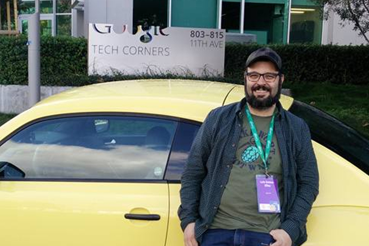
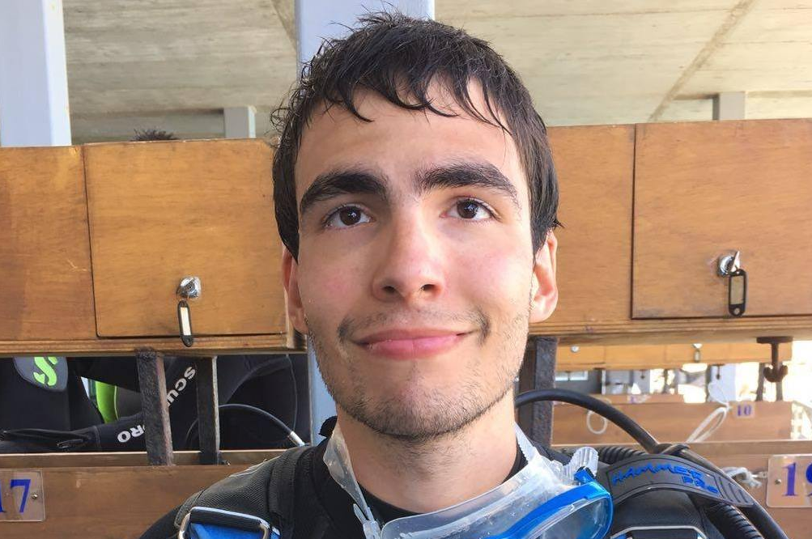
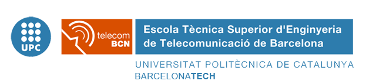
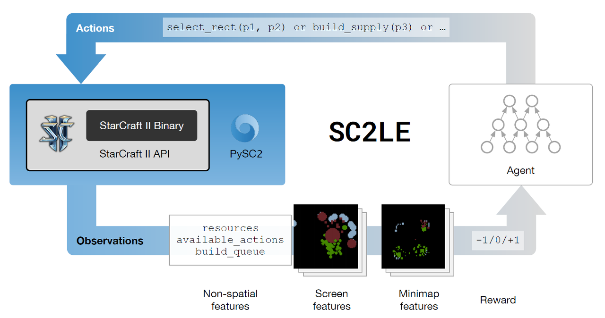
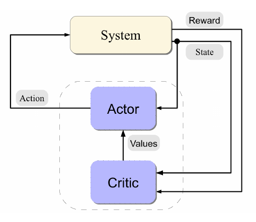
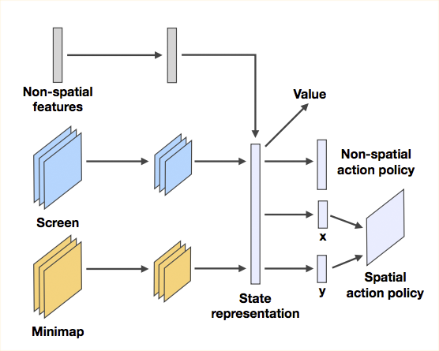
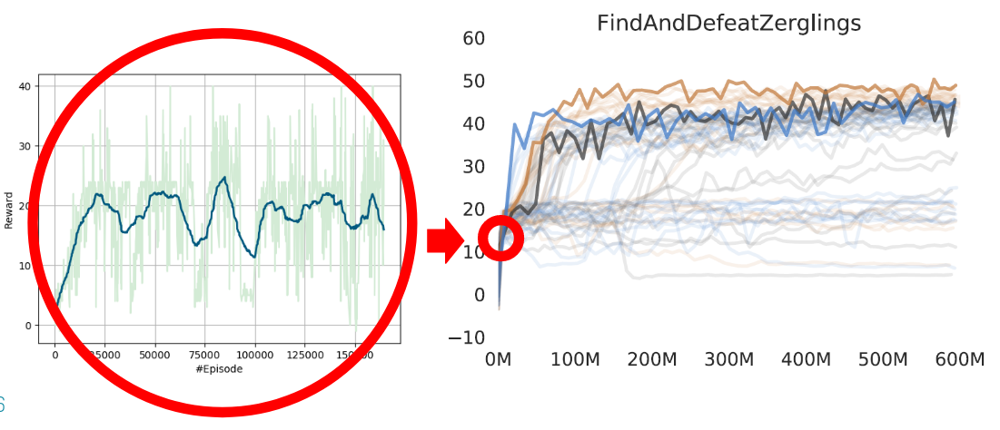
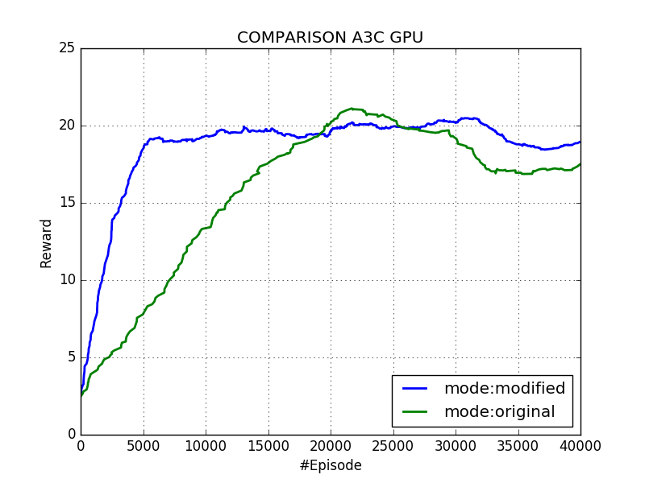

# DLAI 2017 - Project Work Group 5 :
# Playing StarCraft II with Reinforcement Learning 
This is the project repository for the group 5 at the DLAI. The Team is made up by:

|  |  |  |  |
| :---: | :---: | :---: | :---: |
| Luis Esteve Elfau | Godefroy Goffe | Carlos Roig Marí | Alejandro Suárez Hernández |

This project was developed during the [Deep Learning for Artificial Intelligence](https://telecombcn-dl.github.io/2017-dlai/) Course at UPC TelecomBCN, Autumn 2017.

## StarCraft II

As defined on the Blizzard website (the company that develops the game):

>StarCraft II: Wings of Liberty is the long-awaited sequel to the original StarCraft, Blizzard Entertainment’s critically acclaimed sci-fi real-time strategy (RTS) game. StarCraft II: Wings of Liberty is both a challenging single-player game and a fast-paced multiplayer game.
>In typical real-time strategy games, players build armies and vie for control of the battlefield. The armies in play can be as small as a single squad of Marines or as large as a full-blown planetary invasion force. As commander, you observe the battlefield from a top-down perspective and issue orders to your units in real time. Strategic thinking is key to success; you need to gather information about your opponents, anticipate their moves, outflank their attacks, and formulate a winning strategy.

It combines fast paced micro-actions with the need for high-level planning and execution. Over the previous two decades, StarCraft I and II have been pioneering and enduring e-sports, 2 with millions of casual and highly competitive professional players. Defeating top human players therefore becomes a meaningful and measurable long-term objective.

From a reinforcement learning perspective, StarCraft II also offers an unparalleled opportunity to explore many challenging new frontiers:

<ol>
  <li>It is a multi-agent problem in which several players compete for influence and resources. It is also multi-agent at a lower-level: each player controls hundreds of units, which need to collaborate to achieve a common goal.</li>
  <li>It is an imperfect information game. The map is only partially observed via a local camera, which must be actively moved in order for the player to integrate.</li>
</ol>

### PySC2 Environment

|  |  |  |
| :---: | :---: | :---: |
| StarCarft II | Google DeepMind | Python |

PySC2 is DeepMind's Python component of the StarCraft II Learning Environment (<strong>SC2LE</strong>). It exposes Blizzard Entertainment's StarCraft II Machine Learning API as a Python reinforcement learning (<strong>RL</strong>) Environment. 
This is a collaboration between DeepMind and Blizzard to develop StarCraft II into a rich environment for RL research. PySC2 provides an interface for RL agents to interact with StarCraft 2, getting observations and rewards and sending actions.

Scheme 1 explains how SC2LE works combining StarCarft II API with Google DeepMind Libraries:

  
   
   
  Fig. 1: SC2LE. Source: [1].

### Objectives

Playing the whole game is quite an ambitious goal that currently is only whithin the reach of scripted agents. However, the StarCraft II learning environment provides several challenges that are most appropriate to test the learning capabilities of an intelligent agent. It is our intention to develop an intelligent Deep RL agent that can perform successfully on several mini-games with bound objectives. Moreover, we want to experiment with the reward system to see how several changes may influence the behaviour of the agent. That's why we can define our objectives by:

<ul>
  <li>Focusing on small mini-games.</li>
  <li>Training and evaluating several RL agents.</li>
  <li>Dealing and try to improve the reward system (reward "hacking").</li>
</ul>

## Techniques

### Learning Curve

Before starting to train the SC2 agents, we went through a series of [tutorials](https://medium.com/emergent-future/simple-reinforcement-learning-with-tensorflow-part-0-q-learning-with-tables-and-neural-networks-d195264329d0), which implement in [TensorFlow](https://www.tensorflow.org/) the different RL algorithms applied to the [OpenAI GYM](https://gym.openai.com/envs/) environment.

The series goes through the following topics:

<ul>
  <li>Q-Learning with Tables and Neural Networks</li> https://medium.com/emergent-future/simple-reinforcement-learning-with-tensorflow-part-0-q-learning-with-tables-and-neural-networks-d195264329d0
  <li>Two-armed Bandit</li> https://medium.com/@awjuliani/super-simple-reinforcement-learning-tutorial-part-1-fd544fab149
  <li>Contextual Bandits</li> https://medium.com/emergent-future/simple-reinforcement-learning-with-tensorflow-part-1-5-contextual-bandits-bff01d1aad9c
  <li>Policy-based Agents</li> https://medium.com/@awjuliani/super-simple-reinforcement-learning-tutorial-part-2-ded33892c724
  <li>Model-Based RL</li> https://medium.com/@awjuliani/simple-reinforcement-learning-with-tensorflow-part-3-model-based-rl-9a6fe0cce99
  <li>Deep Q-Networks and Beyond</li> https://medium.com/@awjuliani/simple-reinforcement-learning-with-tensorflow-part-4-deep-q-networks-and-beyond-8438a3e2b8df
  <li>Visualizing an Agent’s Thoughts and Actions</li> https://medium.com/@awjuliani/simple-reinforcement-learning-with-tensorflow-part-5-visualizing-an-agents-thoughts-and-actions-4f27b134bb2a
  <li>Partial Observability and Deep Recurrent Q-Networks</li> https://medium.com/emergent-future/simple-reinforcement-learning-with-tensorflow-part-6-partial-observability-and-deep-recurrent-q-68463e9aeefc
  <li>Action-Selection Strategies for Exploration</li> https://medium.com/emergent-future/simple-reinforcement-learning-with-tensorflow-part-7-action-selection-strategies-for-exploration-d3a97b7cceaf
  <li>Asynchronous Actor-Critic Agents (A3C)</li> https://medium.com/emergent-future/simple-reinforcement-learning-with-tensorflow-part-8-asynchronous-actor-critic-agents-a3c-c88f72a5e9f2
</ul>

### A3C

The algorithm of choice for the most successful implementations of Reinforcement Learning agent for StarCraft II seems to be A3C [3]. We have worked on top of two implementations of A3C: [one by Xiaowei Hu](https://github.com/xhujoy/pysc2-agents); and [another by Lim Swee Kiat](https://github.com/greentfrapp/pysc2-RLagents), which at the same time is based on top of Juliani's tutorials on Reinforcement Learning with TensorFlow [2].

#### Theoretical Foundations

A3C is short for Asynchronous Advantage Actor Critic and belongs to the family of the so-called Actor-Critic (from now on, just AC) family of algorithms inside Reinforcement Learning. 

AC algorithms maintain and update a stochastic policy. This is, a map from the current state to a probability distribution over the available actions. This is in contrast to the greedy strategy implemented by Q learning (not counting the random noise introduced to have some degree of exploration). Q learning aims at obtaining the long-term utility of a state-action pair in the so-called Q function. Then, it is enough to take the action that maximizes the utility from the current state (i.e. the action that maximizes Q(s,a) for a given s). Similarly to Q learning, it is often unfeasible to store the support function (either the Q values or the policy) in a table, so a function approximator is employed. This is the point in which Deep Learning steps in: neural networks can play this role, encoding the policy.

AC algorithms implement *generalized policy iteration* or GPI which. This method aims at improving the policy with incomplete information, that is, state, actions and rewards tuples sampled via simulation. GPI consist of two subsystems:

- The **critic**: whose role is evaluating the current policy.
- **Actor**: whose role is acting upon the environment and updating its policy according to the critic's evaluation.

Their interaction is depicted more clearly in Fig. 2. 

  
   
   
  Fig. 2: The interaction bet
  en the Actor-Critic components. Source [4].

The reason for the policy being stochastic is that otherwise there will be not room for improvement: the critic must learn about actions that are not preferred (i.e. have a low probability in the current policy). This allows discovering alternative sequence of operations that seemed unpromising at first but lead to a higher accumulated reward at the end. More interestengly, one could wonder why then it is not better to act completely randomly in order to learn as much of possible. This is, however, undesirable since random policy are very unlikely to discover the interesting (i.e. the most advantageous) areas of the state space, namely, the ones associated with good performance.

A3C works by updating the policy using the so called advantage. The advantage is an estimate of how much increasing the probability of executing an action in a given state would contribute to increase or worsen the long-term reward. The critic calculates this advantage using a forward n-step strategy: this is, aggregating a sequence of up to n (discounted) rewards, obtained following the current policy, plus the approximation of the value function of the last state, minus the estimate of the value of the state at the beginning of the sequence. The idea is to use this advantage to modulate the strength of the update applied to the network (that is computed as the gradient of the likelihood with respect to its parameters). We refer the reader to the original A3C paper [3] and to the Actor-Critic literature [4] for more details on this.

On the other hand, the *Asynchronous* part of the name refers to the fact that A3C launches in parallel several workers that share the same policy network. This is advantageous mainly for two reasons:

- First and more obviously, the gain in raw learning speed, since several workers will be executing episodes in parallel.
- Secondly and, perhaps more importantly from a theoretical point of view, the workers may have different exploratory parameters, therefore increasing the diversity of their experiences. This means, in practice, that the data used to train the network will be more uncorrelated and the learning will be much more rich.

All the updates to the network are performed asynchronously, and since the policy is shared, the workers will benefit from the experiences of their siblings.

## Training RL agents

### Objective

It is our objective to experiment with Reinforcement Learning techniques and analyze their suitability for the StarCraft II game.  We bound our scope to one of the mini-games from the Deep Mind's suite: Find and Destroy Zerglings. We believe that a good player for this game should display a good balance between exploration and combat skills. As for the algorithm, as previously said, we use A3C, encoding the policy with AtariNet [5] (Fig. 3).

  
   
   
  Fig. 3: Atari-Net. Source [1].

The chosen mini-games consists in hunting down Zerglings on a small map using exclusively 3 marines. The position of the Zerglings is unknown a priori, so the player has to explore the map in order to find them. One of the main challenges of this mini-game is that initially there are 19 Zerglings, and enemies respawn only when the previous wave has been cleared. This means that as the episode progresses and the marines kill Zerglings, it gets increasingly difficult to find the next one. We will see that this has a serious impact in the performance of the agent.

### Initial set-up and results

In order to get some sort of tentative results we executed the Hu's implementation in a Google Cloud server for 7 days, with the following specifications:

- 2 K80 GPUs
- 4 virtual cores
- 10GB of RAM

The results were kind of underwhelming: we managed to simulate just around 180000 episodes, stalling at an accumulated reward around 20. At this point it is important to highlight the fact that this reward is very hard to surpass because of strict respawn rules imposed by the mini-game. Moreover, it is very difficult to train for this kind of scenarios under the no-memory assumption adopted by Markov Decision Processes (MDP), the underlying mathematical formalism in which RL is based on (although DeepMind has also used LSTMs in their network, overcoming this issue up to certain extend but moving away from the theoretical guarantees provided by MDPs). Of course, as shown by DeepMind's results the agent can develop an effective strategy for exploring this map even under the no memory assumption. Fig. 4 shows a comparative between our results and theirs. One of the main facts that can be inferred from this chart is that DeepMind has spent a very high amount of resources in obtaining such good results. Our results are too far from this level of performance, but then again, we cannot afford 600M of simulations.

  
   
   
  Fig. 4: (Left) Results after 7 days of training vs (Right) DeepMind results. At the right hand side, the colors represent: (1) Light red, Atari-Net; (2) Light blue, Fully Conv.; (3) Dark blue, Fully Conv. with LSTM.

Interestingly enough, it is possible to observe that even in some of the configurations employed by DeepMind (namely the one with LSTM and AtariNet) they still experience the same issue with the plateau around 20 at the begining of the training. After 100M of episodes the results remain fairly stable.

The main conclusion we draw from this is that training for Reinforcement Learning is very expensive, both in terms of time and money:

- We have estimated that we were simulating near to 26000 episodes per day. At this pace, we would need more than 23000 days (more than 60 years) to complete 600M of episodes (or 10 years for just 100M).
- On the other hand, the estimate of the cost of such training is around $643,963 (Google Cloud fees: $1.15 per hour).

## Next step: hacking the reward

We introduced domain specific knowledge as follows:

- We keep track of the minimum distance from the marines to the Zerglings. Each time this distance increases, we add a small penalty (negative reward) to discourage the marines from fleing, and add a small positive reward when they approach an enemy.
- We believe that correctly managing the camera movements greatly influences the performance of the game, since having it centered in the region of interest (the region where most visble units are located) we increase the chance of hitting the right actions. The rationale is that there are actions for moving and attacking both in the minimap and in the main screen, and if the marines and Zerglings are outside the region covered by the camera, only the actions performed in the minimap are useful for killing Zerglings. For this reason, we add a small reward when the visible region covered by the camera increases after a camera movement.

We can see at Fig. 5 that this has indeed a positive effect in the learning speed of the agent. However, we are not sure of the long term effects if we left the algorithm running for more time.

  
   
   
  Fig. 5: Agent that uses modified ("hacked") rewards vs original agent. Of course, for the sake of comparing both executions in fair conditions only the original rewards (the ones given originally by the environment) are shown. The modified rewards are used internally to update the network.

In addition to this, we have performed several executions to analyze the effect of the learning rate upon the performance of the algorithm with modified rewards. The results are shown in Fig. 7.

  
   
   
  Fig. 6: Different executions varying the learning rate. The executions corresponding to the green and blue curves where halted prematurely because the seemed rather unpromissing. On the other hand, the algorithm seems to perform well enough with a learning rate of 0.0001 and 0.00001. We cannot conclude which will behave better in the long run.

## Results and Conclusions

Of course, we have not achieved Deep Mind's performance, which is beyond our reach in terms of resources. More importantly, our work has been more about exploration, researching and learning rather than about constructing new techniques and pushing forward the state of the art. Along the way, we have introduced ourselves into the fascinating world of Reinforcement Learning ("the cherry on the top"), from which we did not know anything initially, or had very high-level understanding.

We have applied the concept of "reward hacking" to speed-up the learning of the agent with problem specific information. Of course, this is a double-edge sword since on the one hand we can enrich the otherwise sparse reward with domain-specific knowledge, avoiding the many trials-and-errors of less informed search; but on the other hand we have to manipulate the reward to include this domain knowledge, which can be very difficult, and loses a great deal of the appeal and generality of ready-to-go RL algorithms. It is our belief, however, that using RL alone to play StarCraft II will be very challenging and perhaps unfeasible with the current state of the art, unless it is combined with other technique, or used as a subsystem of a more complex artificial intelligence player.

In our experiments (somewhat limited because of our resources), we have found that the default learning rate (0.0001) in the algorithms we tested is indeed well chosen: bigger learning rates result in unstable learning problems while lower learning rates result in very slow learning. On the other hand, tweaking the reward to include domain specific knowledge has resulted in mixed results. While the performance seems to grow faster at the beginning, it stalls around 19. In the mini-game we chose, 19 turns out to be a quite critical score because enemies do not respawn until the first 19 ones have been killed, which requires an efficient exploration technique.

All in all, we believe this to be a fun and challenging task for those interested in the realm of artificial intelligence. In the future we seek to keep learning about this topic and add our own contributions to the field, or apply it to other tasks. We also believe that RL has very promising real-world applications, like assistive robotics or automation and control.

### Video example of a trained agent

## References

1. Vinyals, O., Ewalds, T., Bartunov, S., Georgiev, P., Vezhnevets, A. S., Yeo, M., … Tsing, R. (2017). StarCraft II: A New Challenge for Reinforcement Learning, [link](https://doi.org/https://deepmind.com/documents/110/sc2le.pdf)
2. Simple Reinforcement Learning with Tensorflow series, Arthur Juliani, [link](https://medium.com/emergent-future/simple-reinforcement-learning-with-tensorflow-part-0-q-learning-with-tables-and-neural-networks-d195264329d0) (Accessed: 2017/12/11)
3. Volodymyr Mnih, Adria Puigdomenech Badia, Mehdi Mirza, Alex Graves, Timothy P Lillicrap, Tim Harley, David Silver, and Koray Kavukcuoglu. Asynchronous methods for deep reinforcement learning. ICML, 2016, [link](http://www.jmlr.org/proceedings/papers/v48/mniha16.pdf)
4. Szepesvári, C. (2010). Algorithms for reinforcement learning. Synthesis lectures on artificial intelligence and machine learning, [link](http://www.morganclaypool.com/doi/abs/10.2200/S00268ED1V01Y201005AIM009)
5. Mnih, V., Kavukcuoglu, K., Silver, D., Graves, A., Antonoglou, I., Wierstra, D., & Riedmiller, M. (2013). Playing Atari with Deep Reinforcement Learning, 1–9, [link](https://doi.org/10.1038/nature14236)

